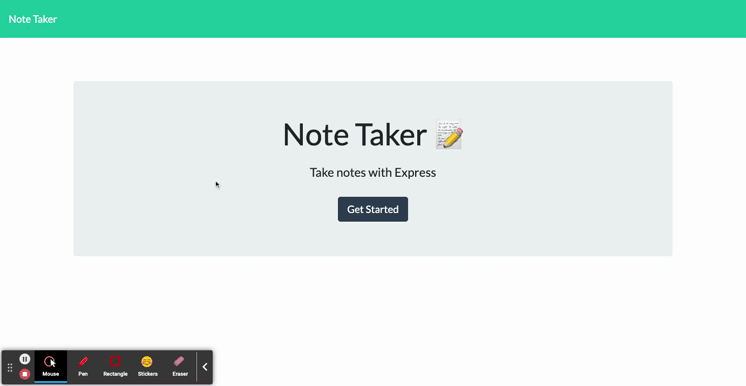
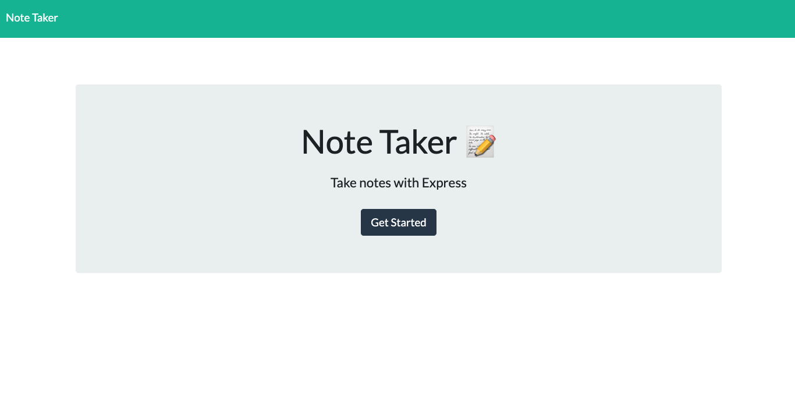

# note-taker

## Description
This is a note taker app developed using Express, Node.js, and JavaScript. The user can write and save notes, which are stored in a JSON file and retrieved via Express.js. I worked on this project primarily to practice the back-end technologies I'm learning, especially Express.js, and to get more familiar with GET/POST requests, routing, and data persistence using JSON.

[The app is deployed on Heroku at this link](https://powerful-spire-74312.herokuapp.com/)

## Table of Contents

- [Installation](#installation)
- [Usage](#usage)
- [Credits](#credits)
- [License](#license)

## Installation

If you want to run this from the command line, or just look at the code, follow these steps. Download the code off of this GitHub repo. From the command line, initialize npm and install express, fs, path, and uuid as dependencies. 

## Usage

If you want to run it from the backend, follow the installation steps and then enter npm start in your command line. The app will be live at the local port 3001. But it's probably easier to see where it's deployed on Heroku: https://powerful-spire-74312.herokuapp.com/notes.

From the landing page, click "Get started." Title your note and type its contents where indicated. A "save" icon will appear in the top-right corner of your screen after you've entered any charaters in the given fields. Click it to save your note. To retrieve saved notes, click where indicated on the left side of the screen.

One word of warning: I did not write the code for a DELETE request route. I hope to do so at a later date, but in the meantime, there's no way for the user to delete saved notes (despite the red delete icon). For now, you can delete notes from the back-end by clearing the db.json file.

## Credits

The following links and documentation proved helpful as I was working on this:
- https://www.npmjs.com/package/uuid
- https://expressjs.com/
- https://stackoverflow.com/questions/23259168/what-are-express-json-and-express-urlencoded
- https://betterprogramming.pub/deploy-your-app-for-free-in-7-easy-steps-thanks-to-heroku-dfd0f387edd0
- https://nodejs.org/en/docs/
- https://nodejs.org/api/path.html#path_path_join_paths
- https://stackoverflow.com/questions/62216144/node-fs-writefile-with-absolute-path
- https://stackoverflow.com/questions/34959038/npm-stuck-giving-the-same-error-eisdir-illegal-operation-on-a-directory-read-a
- https://stackoverflow.com/questions/20753550/enoent-no-such-file-or-directory
- https://heynode.com/tutorial/readwrite-json-files-nodejs/
- https://stackoverflow.com/questions/17162308/node-js-error-cannot-find-module-express
- https://modernweb.com/the-basics-of-express-routes/

## License

Copyright 2021 ©[alexdmacon](https://github.com/alexdmacon). Shared under the [MIT](https://opensource.org/licenses/MIT) license.

## Contributing

Fork this repo, create a branch, and tinker away. Make a pull request and make this thing better.

## Tests

I did not write any testing units for this app. You'll just have to take my word for it that it works. 

## Questions

Got questions? Just reach out and ask.

- Email: alexdmacon@gmail.com
- GitHub: [alexdmacon](https://github.com/alexdmacon)